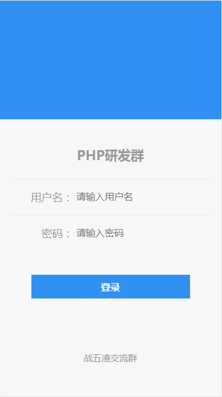
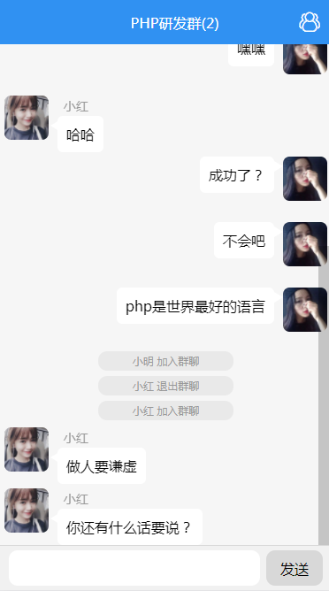
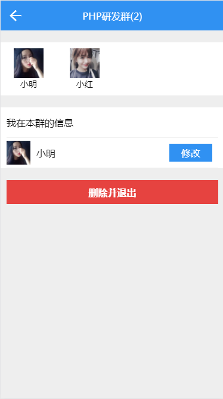

## 前言

本项目是出于兴趣而写，网上虽有相应的项目，但是大部分都是PC端，可是我想写一个移动端的项目。由于能力有限，不懂IOS和Android开发，但是又会一点点H5知识，所以查了一下资料，发现基于Vue来写一个前端页面也挺不错，主要是Vue容易上手。工作期间利用零散时间把Vue的文档看了一遍，在网上找了一个项目学习，最终前端页面就变成了现在所写的样子。

后台本来想用Express或Koa来写，但我是PHP工程师，做这种事情太不符合我的信仰。于是就只好在Workerman或Swoole上选一个框架来开发，考虑到要快速开发，就选用了纯PHP写的Workerman。

项目从设计到开发完这个小demo，一共用了2周，都是在下班后利用零散时间开发，期间经历了好多的坑，也意识到了自己的不足。如果项目有什么不妥指出，请联系我，QQ：287727982。

前端项目参考：[https://github.com/secreter/websocket_chat](https://github.com/secreter/websocket_chat)
## 版本

version：1.0.0

## 技术栈

* Workerman
* GatewayWorker
* Redis
* Mysql
* Vue
* Vue-Router
* Webpack

## 本期版本功能

* 群聊
* 登陆、退出登陆
* 掉线重连
* 登陆和掉线重连后获取离线消息
* 超过设定时间自动退出登陆
* 消息持久化

## 下期版本功能

* 修改个人资料
* 发送图片
* 注册账户
* 下拉加载消息

## 启动项目前

### 导入SQL文件

导入根目录下的chat.sql到Mysql

### 修改配置文件

根据自己的实际情况修改如下配置文件：

	chat_server/config/dev_db.php
	chat_server/config/dev_redis.php
	chat_server/config/dev_static.php

由于Socket.io与GatewayWorker不兼容，所以在Vue中采用了原生的Websocket来连接后端，于是你还要配置：
	
	chat_client/src/api/client.js

里面的GatewayWorker地址WebSocket("ws://192.168.1.245:7272")
	
## 启动项目

### Vue

进入chat_client

	npm install
	npm run dev 开发模式
	npm run build

如果是开发模式下，打开localhost:8080就可以进入登陆页面

### GatewayWorker(Linux环境)

进入chat_server

	php start.php start dev 终端模式
	php start.php start -d dev 后台模式

现在有'dev', 'qa','stage', 'prod'四个环境，不过我只写了dev的配置文件，如果你想切换其它环境，请添加相应的配置文件，比如要上生产环境，则添加

	chat_server/config/prod_db.php
	chat_server/config/prod_redis.php
	chat_server/config/prod_static.php

三个配置文件

## 效果图

### 登陆界面：

### 聊天界面：

### 群信息界面：

## 项目设计图